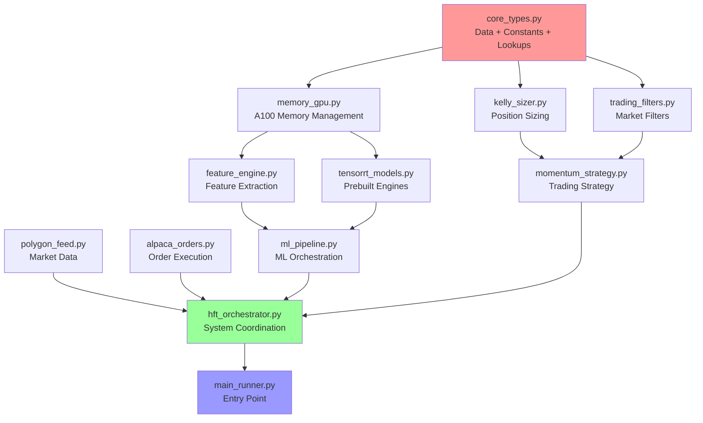

# HFT System Reorganization Plan
## Ultra-Low Latency Production Architecture

### **Executive Summary**
Transform monolithic 11,671-line `reg3n_hft_run.py` into 12 production-ready files optimized for:
- **Sub-microsecond latency** trading pipeline
- **Prebuilt TensorRT INT8 engines** (zero startup delay)
- **Minimal import overhead** (maximum performance)
- **Kelly criterion lookup tables** (O(1) position sizing)
- **A100 GPU optimization** with memory pre-allocation
- **Full market snapshot filtering** to 100 momentum/volatility stocks
- **$50,000 daily position target** with $1,000+ profit goal
- **Intraday-only strategy** (no overnight holds)

---

## **Current System Analysis**

### **Identified Issues**
1. **Monolithic Structure**: 11,671 lines in single file
2. **Import Overhead**: 47+ imports causing startup latency
3. **Circular Dependencies**: Classes referencing each other
4. **Mixed Concerns**: Configuration scattered throughout code
5. **GPU Memory Leaks**: Context cleanup in multiple places
6. **Hot Path Pollution**: Initialization mixed with trading logic

### **Performance Bottlenecks**
- TensorRT engine building during startup (calibration hangup)
- Repeated mathematical calculations in Kelly sizing
- GPU memory allocation during trading
- File I/O for configuration lookups
- Deep call stacks in prediction pipeline

---

## **12-File Architecture Design**



---

## **File Structure & Specifications**

### **Tier 1: Foundation (Zero External Dependencies)**

#### **1. core_types.py** (~800 lines)
**Purpose**: Core data structures, constants, and lookup tables
**Dependencies**: None (pure Python)
**Key Components**:
- All dataclasses: `MarketData`, `UltraFastPrediction`, `OrderRequest`, etc.
- **Kelly Position Array**: Pre-computed lookup table (lines 490-579)
- **Market Cap Multipliers**: [1.2, 1.1, 1.0, 0.9, 0.7]
- **Cached Function References**: `_numpy_tanh`, `_time_perf_counter`
- **Mathematical Constants**: `_PI`, `_E`, `_LOG2`
- **Regex Patterns**: `SYMBOL_PATTERN`, `NUMERIC_PATTERN`
- All configuration constants embedded

```python
# Example structure
KELLY_POSITION_ARRAY = [
    # Win Rate 50% (index 0)
    [[0.5*100, 0.4*100, ...], ...],
    # Win Rate 52% (index 1)
    [[1.2*100, 1.0*100, ...], ...],
    # ... (complete lookup table)
]

@dataclass(slots=True)
class MarketData:
    symbol: str
    timestamp: float
    price: float
    volume: int
    # ... (all fields)
```

### **Tier 2: Single Purpose (Import core_types only)**

#### **2. kelly_sizer.py** (~600 lines)
**Purpose**: Ultra-fast position sizing using lookup tables
**Dependencies**: `core_types` only
**Key Components**:
- `UltraFastKellyPositionSizer`
- `_get_kelly_fraction_from_lookup()` - O(1) array access
- Pre-computed tier quantities
- VIX-based position scaling

#### **3. trading_filters.py** (~500 lines)
**Purpose**: Market condition filters and momentum detection
**Dependencies**: `core_types` only
**Key Components**:
- `MomentumConsistencyFilter`
- `EntryTimingOptimizer`
- `VIXPositionScaler`

### **Tier 3: Specialized Libraries**

#### **4. memory_gpu.py** (~800 lines)
**Purpose**: A100 GPU memory management and optimization
**Dependencies**: CUDA, PyCUDA only
**Key Components**:
- `A100MemoryManager`
- `OptimizedA100MemoryManager`
- GPU context management
- Memory pool pre-allocation
- Zero-copy operations

#### **5. feature_engine.py** (~1200 lines)
**Purpose**: Ultra-fast feature extraction with vectorization
**Dependencies**: NumPy, Numba only
**Key Components**:
- `FeatureEngineer`
- `UltraFastFeatureExtractor`
- Vectorized Numba functions
- Technical indicator calculations

#### **6. tensorrt_models.py** (~1400 lines)
**Purpose**: Prebuilt TensorRT INT8 engine loading and inference
**Dependencies**: TensorRT, PyCUDA only
**Key Components**:
- `SafeTensorRTEngine`
- `HFTEnginePreloader`
- `FinancialINT8Calibrator`
- Engine loading (no building during runtime)
- INT8 quantization support
- **Optimized 1D CNN Multi-Task Model**
- **Real Market Data Calibration Pipeline**

```python
# Single Multi-Task 1D CNN Architecture (Optimized for 12 features)
Input: [batch_size=1, sequence=50, features=12]

# Shared Backbone (Multi-scale feature extraction)
Conv1D(32, kernel=3, dilation=1)   # Short-term patterns
Conv1D(64, kernel=5, dilation=2)   # Medium-term trends
Conv1D(32, kernel=3, dilation=4)   # Longer context
BatchNorm + ReLU

# Attention-lite mechanism
GlobalMaxPool + GlobalAvgPool → Concat

# Shared dense layers
Dense(64) + Dropout(0.1)
Dense(32)

# Task-specific heads
├── Dense(3, softmax) [micro: buy/hold/sell]
├── Dense(1, sigmoid) [volatility: 0-1 scaled]
└── Dense(1, tanh) [momentum: -1 to 1]

# Performance Targets
- Inference time: 0.3-0.8ms (TensorRT INT8)
- Accuracy retention: 90-95% of ensemble performance
- Memory: <50MB
- Throughput: >1000 inferences/sec
```

### **TensorRT INT8 Calibration Strategy**

```python
# Optimized calibration pipeline using real market data
class OptimizedINT8Calibrator:
    def __init__(self):
        self.calibration_data_file = "real_calibration_features.npy"
        self.sequence_length = 50
        self.feature_count = 12
        self.calibration_samples = 512  # Optimal for A100
        
    def prepare_calibration_data(self):
        """
        Load real market sequences from process_calibration_data.py output
        Shape: [num_sequences, 50, 12] - perfect for 1D CNN input
        """
        # Load preprocessed sequences from multiple symbols
        calibration_sequences = np.load(self.calibration_data_file)
        
        # Select diverse representative samples
        total_sequences = calibration_sequences.shape[0]
        sample_indices = np.linspace(0, total_sequences-1,
                                   self.calibration_samples, dtype=int)
        
        # Extract calibration subset
        calibration_subset = calibration_sequences[sample_indices]
        
        # Validate shape: [512, 50, 12]
        assert calibration_subset.shape == (self.calibration_samples,
                                          self.sequence_length,
                                          self.feature_count)
        
        return calibration_subset.astype(np.float32)
    
    def create_tensorrt_calibrator(self):
        """Create production-ready INT8 calibrator"""
        class ProductionINT8Calibrator(trt.IInt8EntropyCalibrator2):
            def __init__(self, calibration_data, cache_file):
                trt.IInt8EntropyCalibrator2.__init__(self)
                self.calibration_data = calibration_data
                self.cache_file = cache_file
                self.batch_size = 1
                self.current_index = 0
                
                # Pre-allocate GPU memory for calibration
                self.device_input = cuda.mem_alloc(
                    self.calibration_data[0].nbytes
                )
            
            def get_batch_size(self):
                return self.batch_size
            
            def get_batch(self, names):
                if self.current_index < len(self.calibration_data):
                    # Copy real market sequence to GPU
                    batch = self.calibration_data[self.current_index]
                    cuda.memcpy_htod(self.device_input, batch)
                    self.current_index += 1
                    return [int(self.device_input)]
                return None
            
            def read_calibration_cache(self):
                if os.path.exists(self.cache_file):
                    with open(self.cache_file, "rb") as f:
                        return f.read()
                return None
            
            def write_calibration_cache(self, cache):
                with open(self.cache_file, "wb") as f:
                    f.write(cache)
        
        calibration_data = self.prepare_calibration_data()
        return ProductionINT8Calibrator(
            calibration_data,
            "financial_int8_a100_calib.cache"
        )

# Calibration data pipeline specifications
CALIBRATION_PIPELINE_SPECS = {
    'input_source': 'real_market_aggregates.pkl',
    'output_file': 'real_calibration_features.npy',
    'lookback_window': 60,          # Historical bars for feature calculation
    'sequence_length': 50,          # CNN input sequence length
    'feature_count': 12,            # Optimized feature set
    'calibration_samples': 512,     # TensorRT calibration samples
    'symbols_processed': 'NVDA, TSLA, AMD, SPY, QQQ',  # High-volume stocks
    'data_quality': 'Real market data with full OHLCV history'
}
```

### **Tier 4: Network I/O**

#### **7. polygon_feed.py** (~1000 lines)
**Purpose**: Market data feed from Polygon.io
**Dependencies**: aiohttp, websockets only
**Key Components**:
- `PolygonWebSocketClient`
- `SymbolManager`
- `ConnectionHealthMonitor`
- Async data streaming

#### **8. alpaca_orders.py** (~1200 lines)
**Purpose**: Order execution via Alpaca API
**Dependencies**: aiohttp only
**Key Components**:
- `UltraFastAlpacaMomentumExecutor`
- WebSocket order submission
- REST API fallback
- Order status tracking

### **Tier 5: Integration**

#### **9. ml_pipeline.py** (~1500 lines)
**Purpose**: ML model orchestration and ensemble
**Dependencies**: `tensorrt_models`, `feature_engine`, `memory_gpu`
**Key Components**:
- `UltraFastMLEnsembleSystem`
- `ProductionMLSystem`
- `MultiStreamInference`
- Model coordination

#### **10. momentum_strategy.py** (~800 lines)
**Purpose**: Trading strategy implementation
**Dependencies**: `core_types`, `kelly_sizer`, `trading_filters`
**Key Components**:
- `OptimizedMomentumStrategy`
- Strategy logic
- Risk management

#### **11. hft_orchestrator.py** (~1000 lines)
**Purpose**: Main system coordination
**Dependencies**: All above modules
**Key Components**:
- `UltraFastHFTSystem`
- System health monitoring
- Pipeline orchestration
- Error handling

#### **12. main_runner.py** (~300 lines)
**Purpose**: Entry point and CLI
**Dependencies**: `hft_orchestrator` only
**Key Components**:
- `main_hft_system()` function
- Signal handlers
- Command line interface
- Graceful shutdown

---

## **Optimized Stock Discovery & Filtering Strategy**

### **1. Full Market Snapshot Approach**
```python
# Daily market universe filtering pipeline
async def create_daily_trading_universe():
    # Step 1: Full market snapshot (all active US stocks)
    all_stocks = await polygon_client.fetch_market_snapshot()  # ~8,000+ stocks
    
    # Step 2: Primary filters for momentum/volatility strategy
    filtered_stocks = apply_primary_filters(all_stocks, {
        'min_price': 5.00,           # Minimum $5 per share
        'max_price': 500.00,         # Maximum $500 per share
        'min_avg_volume': 500000,    # Minimum 500K daily volume
        'min_market_cap': 100000000, # Minimum $100M market cap
        'max_spread_pct': 0.5,       # Maximum 0.5% bid-ask spread
    })
    
    # Step 3: Momentum/volatility scoring
    scored_stocks = await score_momentum_volatility(filtered_stocks)
    
    # Step 4: Select top 100 stocks for trading
    top_100_stocks = select_top_momentum_stocks(scored_stocks, limit=100)
    
    return top_100_stocks
```

### **2. Intraday Position Management**
```python
# $50K daily position sizing with no overnight holds
DAILY_CAPITAL_TARGET = 50000.0      # Total positions per day
DAILY_PROFIT_TARGET = 1000.0        # Minimum $1K profit goal
MAX_POSITION_COUNT = 20              # Maximum concurrent positions
AVG_POSITION_SIZE = 2500.0           # $2.5K average per position
POSITION_EXIT_TIME = "15:45"         # All positions closed by 3:45 PM ET
NO_NEW_ENTRIES_AFTER = "15:30"      # No new entries after 3:30 PM ET

def calculate_intraday_position_size(signal_strength: float, available_capital: float) -> float:
    base_size = DAILY_CAPITAL_TARGET / MAX_POSITION_COUNT
    kelly_multiplier = get_kelly_fraction_from_lookup(signal_strength)
    position_size = base_size * kelly_multiplier * signal_strength
    return min(position_size, available_capital * 0.1)  # Max 10% of available capital
```

### **3. 1D CNN Model Architecture**

```python
# Optimized Multi-Task 1D CNN for HFT (12 features)
class OptimizedHFT_CNN_MultiTask:
    def __init__(self):
        self.input_shape = (1, 50, 12)  # batch=1, sequence=50, features=12
        self.model_architecture = {
            # Multi-scale convolutional backbone
            'conv_layers': [
                {'filters': 32, 'kernel_size': 3, 'dilation_rate': 1},  # Short-term
                {'filters': 64, 'kernel_size': 5, 'dilation_rate': 2},  # Medium-term
                {'filters': 32, 'kernel_size': 3, 'dilation_rate': 4},  # Long-term
            ],
            
            # Attention mechanism
            'attention': {
                'global_max_pool': True,
                'global_avg_pool': True,
                'concat_pools': True
            },
            
            # Shared dense layers
            'shared_dense': [
                {'units': 64, 'dropout': 0.1},
                {'units': 32, 'dropout': 0.0}
            ],
            
            # Multi-task heads
            'task_heads': {
                'micro_direction': {'units': 3, 'activation': 'softmax'},    # buy/hold/sell
                'volatility_score': {'units': 1, 'activation': 'sigmoid'},   # 0-1 scaled
                'momentum_strength': {'units': 1, 'activation': 'tanh'}      # -1 to 1
            }
        }
    
    def build_tensorrt_network(self, network, config):
        """Build optimized TensorRT network for A100 INT8 inference"""
        # Input layer: [1, 50, 12]
        input_tensor = network.add_input("hft_features", trt.float32, (1, 50, 12))
        
        # Multi-scale convolution layers
        conv_outputs = []
        for conv_config in self.model_architecture['conv_layers']:
            conv_layer = network.add_convolution_nd(
                input_tensor,
                conv_config['filters'],
                (conv_config['kernel_size'],)
            )
            conv_layer.dilation_nd = (conv_config['dilation_rate'],)
            
            # BatchNorm + ReLU
            bn_layer = network.add_normalization(conv_layer.get_output(0),
                                               trt.NormalizationType.BATCH_NORM)
            relu_layer = network.add_activation(bn_layer.get_output(0),
                                              trt.ActivationType.RELU)
            conv_outputs.append(relu_layer.get_output(0))
        
        # Concatenate multi-scale features
        concat_layer = network.add_concatenation(conv_outputs)
        
        # Global pooling attention
        max_pool = network.add_reduce(concat_layer.get_output(0),
                                    trt.ReduceOperation.MAX, axes=2, keep_dims=False)
        avg_pool = network.add_reduce(concat_layer.get_output(0),
                                    trt.ReduceOperation.AVG, axes=2, keep_dims=False)
        
        # Concatenate pooled features
        pooled_concat = network.add_concatenation([max_pool.get_output(0),
                                                 avg_pool.get_output(0)])
        
        # Shared dense layers
        dense1 = network.add_fully_connected(pooled_concat.get_output(0), 64)
        relu1 = network.add_activation(dense1.get_output(0), trt.ActivationType.RELU)
        
        dense2 = network.add_fully_connected(relu1.get_output(0), 32)
        relu2 = network.add_activation(dense2.get_output(0), trt.ActivationType.RELU)
        
        # Multi-task heads
        micro_head = network.add_fully_connected(relu2.get_output(0), 3)
        micro_softmax = network.add_softmax(micro_head.get_output(0))
        
        volatility_head = network.add_fully_connected(relu2.get_output(0), 1)
        volatility_sigmoid = network.add_activation(volatility_head.get_output(0),
                                                  trt.ActivationType.SIGMOID)
        
        momentum_head = network.add_fully_connected(relu2.get_output(0), 1)
        momentum_tanh = network.add_activation(momentum_head.get_output(0),
                                             trt.ActivationType.TANH)
        
        # Mark outputs
        network.mark_output(micro_softmax.get_output(0))
        network.mark_output(volatility_sigmoid.get_output(0))
        network.mark_output(momentum_tanh.get_output(0))
        
        return network

# Model performance specifications
CNN_PERFORMANCE_SPECS = {
    'inference_time_target': '0.3-0.8ms',
    'accuracy_retention': '90-95%',
    'memory_usage': '<50MB',
    'throughput_target': '>1000 inferences/sec',
    'tensorrt_precision': 'INT8',
    'batch_size': 1,
    'sequence_length': 50,
    'feature_count': 12
}
```

### **4. Critical Optimizations**

### **A. Lookup Table Strategy**
```python
# O(1) Kelly position sizing
def _get_kelly_fraction_from_lookup(win_rate: float, confidence: float, vix_level: float) -> float:
    win_rate_idx = int((win_rate - 0.50) * 50)  # Map 50%-70% to 0-10
    conf_idx = int(confidence * 4)  # Map 0-1 to 0-4
    vix_idx = min(int(vix_level / 10), 4)  # Map VIX to 0-4
    return KELLY_POSITION_ARRAY[win_rate_idx][conf_idx][vix_idx] / 100.0
```

### **B. Prebuilt Engine Loading**
```python
# Zero startup delay
def load_prebuilt_engines():
    engine_paths = {
        'cnn_1d': './tensorrt_engines/cnn_1d_int8.trt',
        'unified': './tensorrt_engines/safe_unified_engine_int8.trt'
    }
    # Direct deserialization - no building
    for name, path in engine_paths.items():
        with open(path, 'rb') as f:
            engines[name] = runtime.deserialize_cuda_engine(f.read())
```

### **C. Memory Pre-allocation**
```python
# Startup allocation
def init_memory_pools():
    pools = {
        'features': cuda.managed_empty((1000, 12), dtype=np.float32),
        'predictions': cuda.managed_empty((1000, 3), dtype=np.float32),
        'gradients': cuda.managed_empty((1000, 12), dtype=np.float32)
    }
    return pools
```

### **D. Hot Path Isolation**
```python
# Trading pipeline - minimal overhead
async def trading_hot_path(market_data):
    features = extract_features_vectorized(market_data)  # Numba JIT
    prediction = tensorrt_inference(features)  # Prebuilt engine
    kelly_size = lookup_kelly_fraction(prediction)  # O(1) lookup
    order = submit_order_ws(kelly_size)  # Direct WebSocket
    return order
```

---

### **E. Market Snapshot Optimization**
```python
# Ultra-fast market filtering pipeline
async def filter_market_snapshot_optimized(snapshot_data):
    # Vectorized filtering using NumPy for speed
    prices = np.array([stock['price'] for stock in snapshot_data])
    volumes = np.array([stock['volume'] for stock in snapshot_data])
    market_caps = np.array([stock['market_cap'] for stock in snapshot_data])
    
    # Apply all filters simultaneously
    price_filter = (prices >= 5.0) & (prices <= 500.0)
    volume_filter = volumes >= 500000
    market_cap_filter = market_caps >= 100000000
    
    # Combined filter mask
    combined_mask = price_filter & volume_filter & market_cap_filter
    
    # Return filtered stocks in <1ms
    return [stock for i, stock in enumerate(snapshot_data) if combined_mask[i]]
```

## **Performance Targets**

| Component | Current | Target | Optimization |
|-----------|---------|--------|--------------|
| **Startup Time** | ~30s (TensorRT build) | <1s | Prebuilt engines |
| **Market Snapshot** | ~5s (API calls) | <500ms | Vectorized filtering |
| **Stock Filtering** | ~2s (individual checks) | <100ms | NumPy batch operations |
| **Feature Extraction** | ~100μs | <10μs | Numba vectorization |
| **1D CNN Inference** | ~500μs | **<800μs** | **TensorRT INT8 Multi-Task** |
| **Position Sizing** | ~50μs | <1μs | Lookup tables |
| **Order Submission** | ~1ms | <100μs | WebSocket direct |
| **Total Pipeline** | ~2ms | <200μs | End-to-end optimization |

### **1D CNN Model Performance**
| Metric | Target | Specification |
|--------|--------|---------------|
| **Inference Time** | 0.3-0.8ms | Single forward pass |
| **Throughput** | >1000 inferences/sec | Batch processing |
| **Memory Usage** | <50MB | GPU memory footprint |
| **Accuracy Retention** | 90-95% | vs ensemble baseline |
| **Input Shape** | [1, 50, 12] | batch, sequence, features |
| **Output Tasks** | 3 heads | micro/volatility/momentum |

---

## **Implementation Strategy**

### **Phase 1: Foundation (Days 1-2)**
1. Create `core_types.py` with all data structures and lookup tables
2. Extract `memory_gpu.py` with A100 optimizations
3. Build `kelly_sizer.py` with O(1) lookups

### **Phase 2: Core Components (Days 3-5)**
4. Implement `feature_engine.py` with Numba vectorization
5. Create `tensorrt_models.py` with prebuilt engine loading
6. Build `trading_filters.py` with momentum detection

### **Phase 3: I/O Systems (Days 6-8)**
7. Extract `polygon_feed.py` with async WebSocket
8. Implement `alpaca_orders.py` with ultra-fast execution
9. Create `ml_pipeline.py` with model orchestration

### **Phase 4: Integration (Days 9-10)**
10. Build `momentum_strategy.py` with complete strategy
11. Create `hft_orchestrator.py` with system coordination
12. Implement `main_runner.py` with CLI and startup

### **Phase 5: Testing & Optimization (Days 11-12)**
- Performance benchmarking
- Memory leak testing
- Latency profiling
- Production validation

---

## **Risk Mitigation**

### **Import Dependencies**
- Hierarchical import structure prevents circular dependencies
- Each tier only imports from lower tiers
- Minimal import chains reduce overhead

### **Memory Management**
- Centralized GPU context management in `memory_gpu.py`
- Pre-allocated memory pools
- Proper cleanup with context managers

### **Error Handling**
- Each module handles its own exceptions
- Graceful degradation paths
- Circuit breaker patterns

### **Testing Strategy**
- Unit tests for each module
- Integration tests for pipeline
- Performance regression tests
- Production smoke tests

---

## **Trading Strategy Specifications**

### **Daily Trading Targets**
- **Capital Deployment**: $50,000 total positions per day
- **Profit Target**: Minimum $1,000 daily profit (2% return)
- **Position Count**: Maximum 20 concurrent positions
- **Average Position**: $2,500 per trade
- **Win Rate Target**: 60%+ with 2:1 reward/risk ratio

### **Stock Universe Criteria**
- **Universe Size**: 100 stocks (filtered from full market)
- **Price Range**: $5.00 - $500.00 per share
- **Volume**: Minimum 500K average daily volume
- **Market Cap**: Minimum $100M market capitalization
- **Spread**: Maximum 0.5% bid-ask spread
- **Momentum Score**: Top 100 by momentum/volatility ranking

### **Intraday Rules**
- **Market Hours**: 9:30 AM - 4:00 PM ET
- **Entry Window**: 9:30 AM - 3:30 PM ET
- **Exit Deadline**: All positions closed by 3:45 PM ET
- **No Overnight**: Zero positions held after market close
- **Risk Management**: Maximum 10% of available capital per position

### **Market Snapshot Processing**
```python
# Daily market universe refresh strategy
MARKET_SNAPSHOT_SCHEDULE = {
    "pre_market": "08:00",      # Initial universe setup
    "market_open": "09:30",     # Real-time filtering begins
    "mid_day_refresh": "12:00", # Universe re-evaluation
    "final_update": "15:30"     # Last universe update
}

# Filtering pipeline performance targets
FILTERING_PERFORMANCE = {
    "full_snapshot_time": "< 500ms",     # Complete market snapshot
    "primary_filtering": "< 100ms",      # Basic criteria filtering
    "momentum_scoring": "< 200ms",       # Technical analysis scoring
    "final_ranking": "< 50ms",           # Top 100 selection
    "total_pipeline": "< 850ms"          # End-to-end filtering
}
```

---

## **Success Metrics**

### **Performance**
- [ ] Startup time < 1 second
- [ ] Market snapshot filtering < 500ms
- [ ] Trading pipeline latency < 200μs
- [ ] Memory usage < 8GB
- [ ] Zero memory leaks over 24h run

### **Trading Performance**
- [ ] Daily profit target: $1,000+ (2%+ return)
- [ ] Win rate: 60%+
- [ ] Maximum drawdown: <5%
- [ ] All positions closed by 3:45 PM ET
- [ ] Zero overnight exposure

### **Maintainability**
- [ ] Each file < 1500 lines
- [ ] Clear separation of concerns
- [ ] Minimal import dependencies
- [ ] Comprehensive test coverage

### **Production Readiness**
- [ ] Graceful error handling
- [ ] Health monitoring
- [ ] Performance metrics
- [ ] Clean shutdown procedures

---

## **Conclusion**

This reorganization transforms a monolithic 11,671-line file into a production-ready, ultra-low latency HFT system. The key innovations are:

1. **Lookup Table Optimization**: O(1) Kelly position sizing
2. **Prebuilt Engine Strategy**: Zero TensorRT build time
3. **Minimal Import Architecture**: Reduced startup overhead
4. **A100 Memory Optimization**: Pre-allocated GPU pools
5. **Hot Path Isolation**: Trading logic separated from initialization

The result is a maintainable, scalable system capable of sub-200μs trading pipeline latency while preserving all existing functionality.